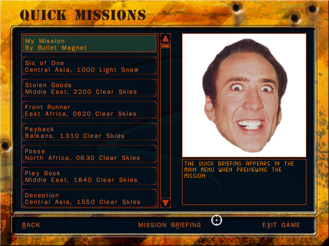

# Delta Force Quick Mission Importer

A CLI for importing quick missions into Delta Force games. Delta Force 2 is currently the only supported game.

> This is a proof of concept and isn't terribly user-friendly, although it is an improvement over manually editing .pff and .bin files.
> If there is interest in growing this project, I will create a GUI to make things easier.

## Install

Download [import-quick-mission.zip][download] and extract `import-quick-mission.exe` into your Delta Force 2 folder.

[download]: https://github.com/SeeSharpCode/df-quick-mission-importer/releases/download/0.1.0/import-quick-mission.zip

## Creating a Mission

This section is for mission authors. If you're trying to import a mission created by someone else, skip to [Importing a Mission](#importing-a-mission).

1. Create a .bms file with the MED as normal. You'll need to follow the DF2 naming convention for quick missions which is `D06M` followed by two alphanumeric characters.
   I recommend # or ! followed by a number or letter so that your mission appears at the top of the list, e.g., `D06M#1.bms`.
1. Create a metadata YAML file with the same name, e.g., `D06M#1.yaml`. Don't worry if you don't know YAML, just copy the example below and substitute your text:
   ```yaml
   title: |
     My Mission
     By Bullet Magnet
   quickBriefing: The quick briefing appears in the main menu when previewing the mission.
   longBriefing: |
     The long briefing appears when you select a mission.
     
     It can be multiple lines.

     Like this.
   ```
1. (Optional) include a 240x240 TGA image with the same name, e.g., `D06M#1.tga`. This appears in the main menu when previewing the mission.

## Importing a Mission

1. Place all mission files created in [Creating a Mission](#creating-a-mission) in your Delta Force 2 folder.
1. Open a Windows terminal (Terminal, PowerShell, cmd, etc.) inside your Delta Force 2 folder.
   1. A simple way is to right-click inside your Delta Force 2 folder and click **Open in Terminal**.
1. Enter `./import-quick-mission.exe <your-mission-name>`, replacing `<your-mission-name>` with the name of your .bms file (exclude the .bms extension).
   1. For example, if your mission file is named `D06M#1.bms`, the command would be `./import-quick-mission.exe D06M#1`.
   1. You should see console output similar to this:
      ```powershell
      PS D:\Games\Novalogic\Delta Force 2\Sandbox> .\import-quick-mission.exe D06M#1
      Backing up df2.pff to df2.pff.backup...
      Reading df2.pff...
      Reading df2brief.bin...
      Adding briefings...
      Packing TGA image...
      Saving df2.pff...
      Renaming D06M#1.BMS to D06M#1.BMS.packed since it is now packed in df2.pff...
      Successfully imported mission!
      ```

The quick mission should now be fully imported with a proper title, briefing, and image (if applicable):



## Behind the Scenes

The CLI does the following:

1. Back up `df2.pff` as `df2.pff.backup`.
1. Pack the .bms and .tga files in `df2.pff`.
1. Append the text from the metadata YAML file to `df2brief.bin` inside `df2.pff`.
